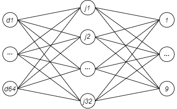

<h3>0001 - Simple CNN with Tensorflow</h3>

<body>

<h4>Convolutional neural networks that recognize numbers in 28x28 pixel images from the mnist dataset</h4>

<h4>Activation functions implemented: 
      ReLu
</h4>

</body>
