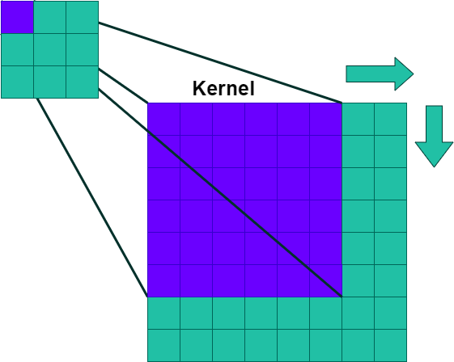

<h2><b>Simple CNN with Tensorflow</b></h2>
<h3>Convolutional neural networks that recognize numbers in 28x28 pixel images from the mnist.dataset</h3></h2>
<p align='center'></p>
<h3>Dependencies</h3>

```python
import matplotlib.pyplot as plt
import tensorflow
from keras.datasets import mnist
from keras.utils import to_categorical
from keras.models import Sequential
from keras.layers import Conv2D, Flatten, Dense
```
<h4>keras.models.Sequential</h4>
<h4>keras.layers.Conv2D</h4>
<h4>keras.layers.Flatten</h4>
<h4>keras.layers.Dense</h4>

```python
# initialize and compile model
model = Sequential()
model.add(Conv2D(64, kernel_size = 3, activation='relu', input_shape(28,28,1)))
model.add(Conv2D(32, kernel_size = 3, activation='relu'))
model.add(Flatten())
model.add(Dense(10, activation='softmax')
model.compile(optmizer='adam', loss='category_crossentropy', metrics=['accuracy'])
```
</br>
<h3>Architecture</h3>
<p align='center'></p>
</br>
<h3>Activation functions</h3>
<ol>
      <li>ReLU</li>
      <li>Softmax</li>
</ol>

<h4>ReLU - Rectified Linear Unit</h4>

```python
def relu(x):
    return max(0,x)
```

<h5><p align='Justify'>This activation function started showing up in the context of visual feature extraction in hierarchical neural networks starting in the late 1960s. It was later argued that it has strong biological motivations and mathematical justifications.In 2011 it was found to enable better training of deeper networks, compared to the widely used activation functions prior to 2011, e.g., the logistic sigmoid (which is inspired by probability theory; see logistic regression) and its more practical counterpart, the hyperbolic tangent. The rectifier is, as of 2017, the most popular activation function for deep neural networks. <a href="https://en.wikipedia.org/wiki/Rectifier_(neural_networks)" target ="_blank">[wikipedia]</a></p></h5>
<h5><i>"The ReLU will output the input directly if it is positive, otherwise, it will output zero"</i>.<a href="https://machinelearningmastery.com/rectified-linear-activation-function-for-deep-learning-neural-networks/#:~:text=The%20rectified%20linear%20activation%20function,otherwise%2C%20it%20will%20output%20zero.">[machinelearningmastery]</a></h5>

</br>

<p align='center'></p>

<h4>Softmax</h4>
</br>
<h3>Kernel, Filter and Convolution</h3>

<h4>Kernel - Whats is?<h4>

<p align='center'></p>
</br>
<h3>Optimization Algorithms</h3>
<h4>Adam</h4>
